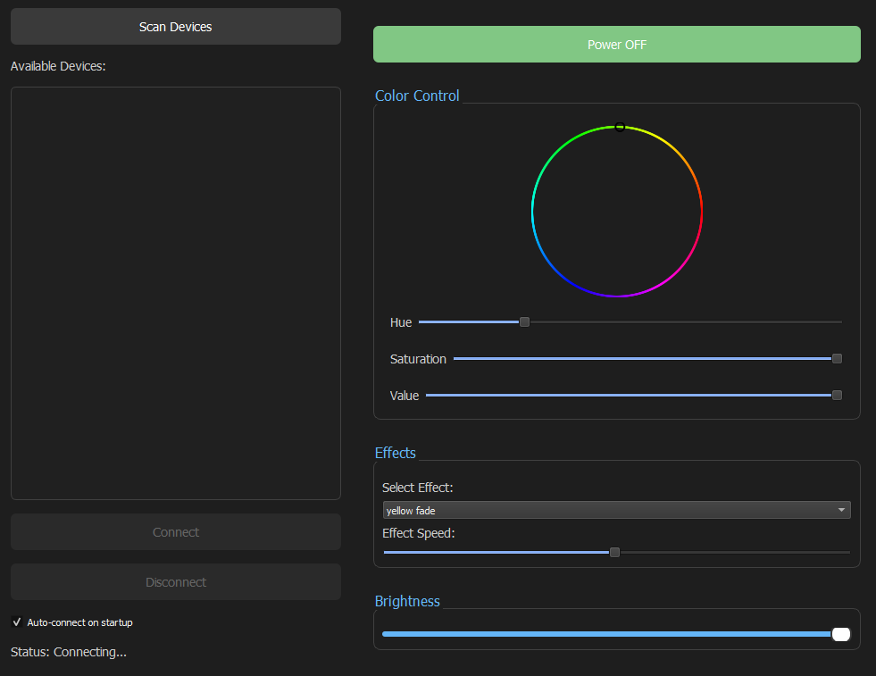

# BLK-BLEDOB Controller

<div style="display: flex; justify-content: center;">
    
</div>


A modern, feature-rich PyQt5-based controller for BLK-BLEDOB LED devices with an intuitive dark-themed interface.

## Features ✨

### Core Functionality
- **Advanced BLE Device Scanning** - Discover compatible LED devices with RSSI signal strength indication
- **Secure Connection Management** - Establish and maintain reliable Bluetooth connections with auto-reconnect capability
- **Modern Dark Theme Interface** - Sleek, user-friendly design with high contrast controls

### LED Control Features
- **Interactive Color Wheel** - High-resolution color selection with real-time preview
- **HSV Color Control** - Precise adjustment through Hue, Saturation, and Value sliders
- **Dynamic Effects** - Multiple built-in lighting effects with customizable speed
- **Brightness Control** - Smooth 0-100% brightness adjustment
- **Power Management** - Instant ON/OFF switching with visual feedback

### Smart Features
- **Auto-Connect** - Optional automatic connection to last used device
- **Persistent Settings** - Saves all user preferences including:
  - Window position and size
  - Last used color and brightness
  - Selected effect and speed
  - Auto-connect preference
  - Device connection history

## System Requirements 💻

- **Operating System**: Windows 10/11
- **Python Version**: 3.8+
- **Bluetooth**: Version 4.0+ with BLE support

## Installation ⚙️

1. **Clone repository**:
```bash
git clone https://github.com/Arrowar/BLK-BLEDOB.git
cd BLK-BLEDOB
```

2. **Install dependencies**:
```bash
pip install -r requirements.txt
```

## Usage 🚀

### Running the Application
```bash
python app.py
```

### First-Time Setup

1. Launch the application
2. Click "Scan Devices" to discover nearby BLE devices
3. Select your BLK-BLEDOB device from the list (devices show name, address, and signal strength)
4. Click "Connect" to establish connection
5. Use the control panel to manage your device:
   - Power button: Toggle device ON/OFF
   - Color wheel: Select colors visually
   - HSV sliders: Fine-tune color properties
   - Effects dropdown: Choose from available light effects
   - Speed slider: Adjust effect animation speed
   - Brightness slider: Control overall light intensity

### Auto-Connect Feature
- Enable "Auto-connect on startup" checkbox to automatically connect to the last used device
- The application will remember your device and attempt to reconnect when launched

## Building Executable 📦

1. **Install PyInstaller**:
```bash
pip install pyinstaller
```

2. **Generate executable**:
```bash
pyinstaller --onefile --windowed --name "BLK-BLEDOB Controller" app.py
```

Executable will be created at: `dist/BLK-BLEDOB Controller.exe`

## Technical Specifications 🔌

### Supported BLE Services

```python
SERVICE_UUIDS = [
    "ffd0",
    "fff0", 
    "0000ffd0-0000-1000-8000-00805f9b34fb",
    "0000fff0-0000-1000-8000-00805f9b34fb"
]
```

### Command Protocol

| Function | Command Format | Description |
|----------|---------------|-------------|
| Power ON | `7e0704ff00010201ef` | Turns the device on |
| Power OFF | `7e07040000000201ef` | Turns the device off |
| Set Color | `7e070503[RR][GG][BB]10ef` | Sets RGB color ([RR][GG][BB] are hex values) |
| Set Brightness | `7e0401[LEVEL]01ff0201ef` | Sets brightness level (0-100) |
| Set Effect | `7e070603[MODE]03[SPEED]10ef` | Sets light effect and speed |

### User Interface Components
- **MainWindow**: Core application window with dark theme
- **ColorWheel**: Custom widget for intuitive color selection
- **BLE Manager**: Handles device discovery and connection
- **Settings Manager**: Manages persistent user preferences

## Contributing 🤝
Contributions are welcome! Please feel free to submit a Pull Request.

## Source 📚
- Original protocol implementation: [GitHub - dave-code-ruiz/elkbledom](https://github.com/dave-code-ruiz/elkbledom)
- Demo video: [YouTube Demo](https://youtu.be/uAREIjy62v0)

## License 📄
This project is licensed under the MIT License - see the LICENSE file for details.